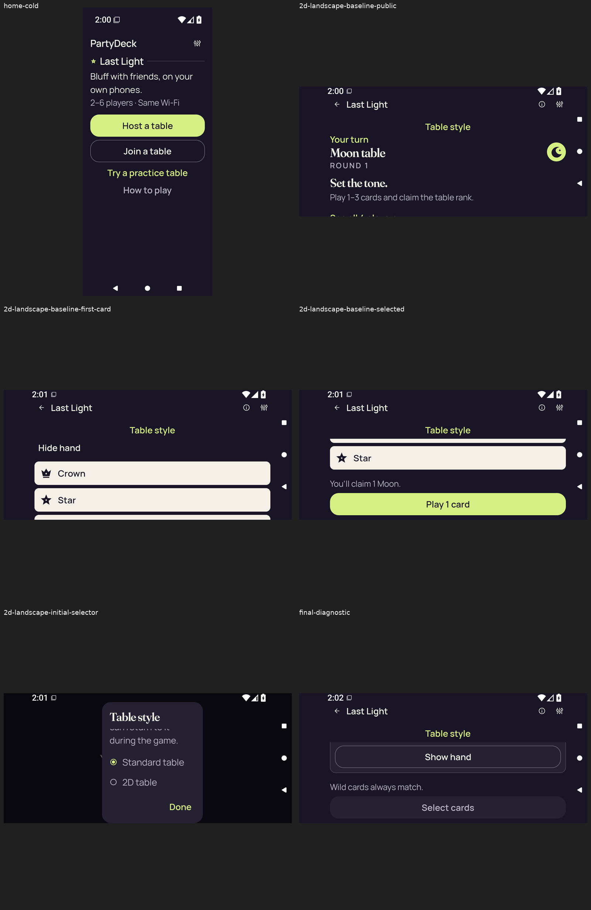
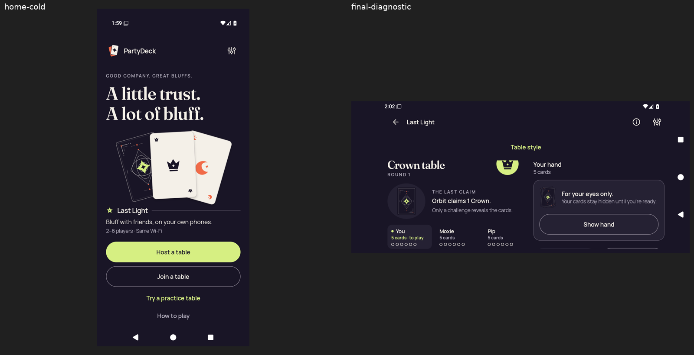
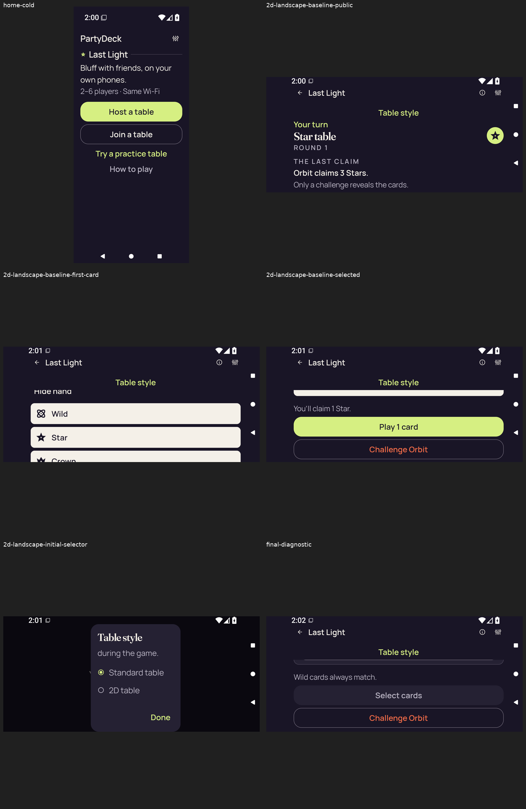

# Supplemental API36 review sheets

These four unchanged audit derivatives were viewed during review. They resize and label the 16 original stills; they contribute **zero** additional original captures. The run remains failed and unqualified. Original images and XML are in [the run collection](../../godot-android-adaptive-34485033488/README.md).

## Publication review

The 16 original stills were visually inspected through the four existing frozen review sheets. The original PNGs were separately decoded and matched to their recorded hashes and dimensions. Capture identities remain separate when pixels match. The review describes the captured viewport; it adds no native execution or assistive-technology result.

[Completed visual review](../../godot-android-adaptive-34485033488/provenance/publication-review/partydeck-gallery-next2-adaptive-visual-review.json) · [Publication copy audit](../../godot-android-adaptive-34485033488/provenance/publication-review/partydeck-gallery-next2-ready-source-audit.json) · [Frozen queue](../../godot-android-adaptive-34485033488/provenance/publication-queue-v1/queue-freeze.json) · [Original copy mapping](../../godot-android-adaptive-34485033488/provenance/publication-queue-v1/copy-paths.tsv) · [Original queue page](../../godot-android-adaptive-34485033488/provenance/publication-queue-v1/payload/docs/screenshots/supplemental/android-adaptive-34485033488-review-sheets/README.md). The archived queue page retains its original text and relative paths as provenance.

| Derived sheet | Provenance |
| --- | --- |
|  | [debug-font-1.0-original-stills-overview.png](debug-font-1.0-original-stills-overview.png) Derived review sheet of the preserved failed-run stills; resized and labeled for review. This is not an additional original capture. 1600 × 820 px SHA-256: <code>54f646322dadd3aaa472ed48ef96762c16c2e1dada53231c85493813bda4e9e2</code> **Publication observations:** home-cold: The cold Home original shows the complete hero and Host, Join, Practice and How to play actions. final-diagnostic: The final landscape Standard table shows Orbit claims 2 Crowns, a concealed hand and a complete Show hand control. Lower gameplay actions extend below the captured viewport. |
|  | [debug-font-2.0-original-stills-overview.png](debug-font-2.0-original-stills-overview.png) Derived review sheet of the preserved failed-run stills; resized and labeled for review. This is not an additional original capture. 1600 × 2460 px SHA-256: <code>6ce1a929cb4f7e34c3855ca589d909b2b52393ad7f34fafc5b7e508aca873a11</code> **Publication observations:** home-cold: At 200% text, all four Home actions are complete and readable. 2d-landscape-baseline-public: The landscape public baseline shows Your turn, Moon table, round and opening instructions. Lower content is clipped at the captured viewport edge or lies below it. 2d-landscape-baseline-first-card: The scrolled hand baseline shows Hide hand and readable Crown and Star rows; further rows are below the viewport. Turn and rank are no longer visible at this scroll position. 2d-landscape-baseline-selected: The selected baseline shows the full claim of 1 Moon and complete Play 1 card action. The selected card itself is above the captured viewport; its selection marker is not shown here. 2d-landscape-initial-selector: The Table style picker shows Standard selected, the 2D choice and a complete Done action. Introductory text clips beneath the title and lower choices require scrolling. final-diagnostic: The picker is gone in the final landscape original, leaving the concealed Standard hand. Full Show hand, Wild guidance and disabled Select cards are visible. |
|  | [optimized-test-signed-font-1.0-original-stills-overview.png](optimized-test-signed-font-1.0-original-stills-overview.png) Derived review sheet of the preserved failed-run stills; resized and labeled for review. This is not an additional original capture. 1600 × 820 px SHA-256: <code>215dab2aec39820f2569f93bfbd41f64216ec4cf9c7aade9dbf4b8e28f110e12</code> **Publication observations:** home-cold: The cold Home original shows the complete hero and all four Home actions. final-diagnostic: The final landscape Standard table shows Crown table and Orbit claims 1 Crown. The Crown emblem clips at the upper content edge. The concealed hand and Show hand fit; lower gameplay actions are outside this viewport. |
|  | [optimized-test-signed-font-2.0-original-stills-overview.png](optimized-test-signed-font-2.0-original-stills-overview.png) Derived review sheet of the preserved failed-run stills; resized and labeled for review. This is not an additional original capture. 1600 × 2460 px SHA-256: <code>3dd88637fae6f4abfda497f5d09fcbc6392e0845c106899ad9acbf9a6fb6fa71</code> **Publication observations:** home-cold: At 200% text, all four Home actions are complete and readable. 2d-landscape-baseline-public: The landscape public baseline shows Your turn, Star table and Orbit claims 3 Stars. The hand and lower actions lie below the captured viewport. 2d-landscape-baseline-first-card: The scrolled hand baseline shows complete Wild and Star rows, with the Crown row partly below the viewport. Hide hand clips at the upper edge; turn and rank are offscreen. 2d-landscape-baseline-selected: The selected baseline shows the claim of 1 Star, complete Play 1 card and Challenge Orbit. The selected card itself lies above the viewport, so this image does not show its selection marker. 2d-landscape-initial-selector: The Table style picker has clipped introductory text; Standard is selected, and 2D and Done are visible. Lower choices need scrolling. final-diagnostic: The picker is gone and the final landscape original shows a concealed Standard table. Show hand lies above the viewport, with only the lower container edge visible. Wild guidance, disabled Select cards and Challenge Orbit fit. |

[Original source-image mappings and FFmpeg derivation](still-overviews.json).
