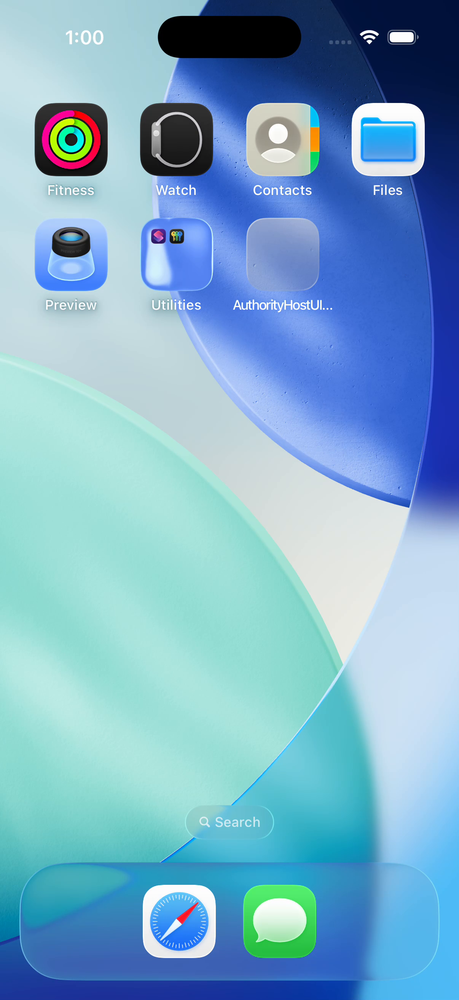
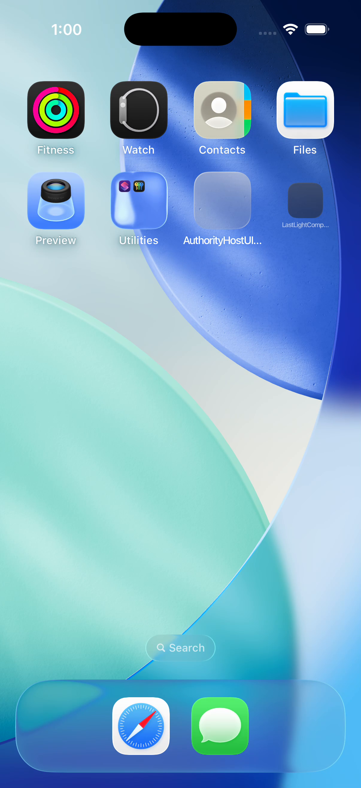
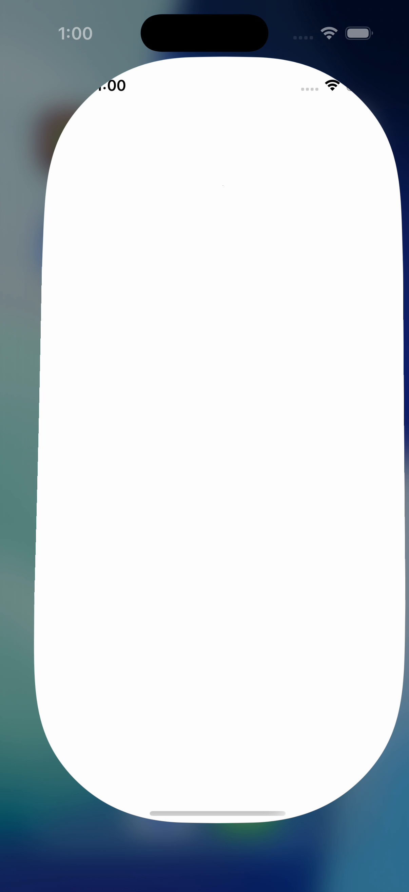
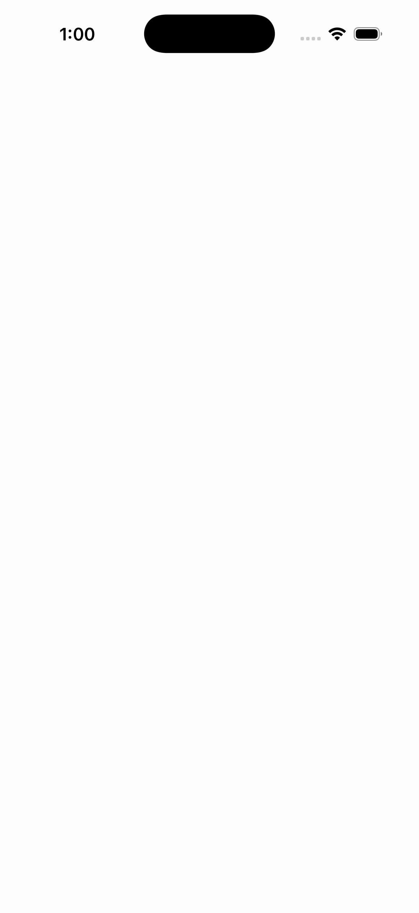
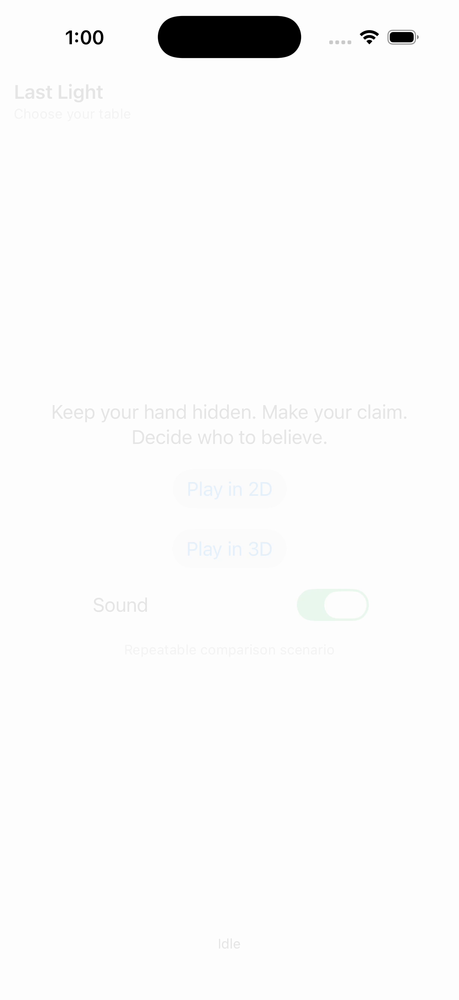
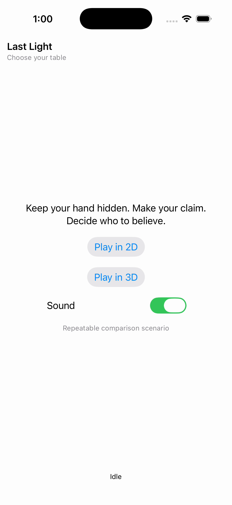

# iOS launch recording — nine supplemental decoded frames

**These nine PNGs are decoded video frames, separate from the gallery’s original screenshot totals.** They preserve the decoder’s original filenames, bytes and native 1206 × 2622 dimensions. Thumbnails open those same unchanged decoded files. All nine were independently reviewed for publication; the other 120 decoded frames were hash-verified and remain outside this selected visual review.

The source is the [original CI recording](recording/856F498D-90C1-48CC-8225-0A35C78305BA.mp4), SHA-256 `399b9f05d4f06728d0709e16fd80a989ad81299a6985376aac8c62e774b2fa25`, from exact revision `c6ea1dd9f7966517fbee87a06b633d01c432c24d`. The [authority test collection](../../godot-ios-authority-34478720554/README.md) retains the failed `testReferenceMatchIn2DAt200Percent()` launch. It has no original CI PNG or initial app measurement.

The reviewed sequence shows Home, an expanding white app window, blank white app views and a late Idle chooser. The failed launch remains failed. A `start-2d` tap attempt is logged, but event delivery and native scene entry are unproven. The test’s 2D/200% label does not establish a 200% chooser or renderer appearance.

## Derivation and timing

FFmpeg performed H.264 decoding and YUV-to-RGB conversion only, without scaling, cropping, interpolation, annotation or generated imagery. The original variable-rate video has 129 samples and a 1/600 time base. The [complete decoded-frame manifest](evidence/decoded-frame-manifest.json) retains all sample metadata and hashes; the [original viewed-frame queue](evidence/viewed-frames.json) preserves the original review order and observations.

The table uses exact relative PTS. Consecutive samples 72 and 73 are separated by **3.501667 seconds**, limiting the blank-to-chooser onset precision. MP4 creation metadata says `12:59:01 UTC`, while the recording attachment says `12:59:02.094 UTC`; neither has been established as PTS zero. Absolute frame-to-UTC alignment remains unresolved. The [original timeline](evidence/timeline.json) preserves both conditional alignments.

The [frozen investigation](evidence/RESULT.md), [independent publication audit](review/partydeck-gallery-next-video-source-audit.json) and [publication visual review](review/partydeck-gallery-next-video-visual-review.json) retain the input identities and limits. All 160 frozen supplement files were hash-verified. This evidence does not identify an OS/debugger cause or qualify native gameplay.

| Decoded video frame | PTS and provenance |
| --- | --- |
|  | **Launch recording at PTS 0.000000 s** iPhone 17 simulator recording Decoded file: [frame-0001.png](frames/frame-0001.png) 1206 × 2622 px; text scale not separately recorded SHA-256: <code>17557f9b8d04d1a58a3edabddb321d72c249536a791744e884171e8f90ca9f81</code> Original video PTS: 0.000000 s; time base 1/600. Derived video frame; excluded from original CI PNG totals. Recorded enclosing case: Failure Actual iOS Home is visible with clock 12:59, the runner icon and Safari/Messages dock. No game view is visible. |
|  | **Launch recording at PTS 58.351667 s** iPhone 17 simulator recording Decoded file: [frame-0002.png](frames/frame-0002.png) 1206 × 2622 px; text scale not separately recorded SHA-256: <code>c6e7e644f95616533fb744648b7b217406f416b7785428042088f47365503812</code> Original video PTS: 58.351667 s; time base 1/600. Derived video frame; excluded from original CI PNG totals. Recorded enclosing case: Failure Actual iOS Home remains visible with clock 1:00, the runner icon and Safari/Messages dock. |
|  | **Launch recording at PTS 76.285000 s** iPhone 17 simulator recording Decoded file: [frame-0003.png](frames/frame-0003.png) 1206 × 2622 px; text scale not separately recorded SHA-256: <code>249abf0a164d3ef96bdd9a30251bd0d45b5ab361111c5015bdf28a37daf85e49</code> Original video PTS: 76.285000 s; time base 1/600. Derived video frame; excluded from original CI PNG totals. Recorded enclosing case: Failure Actual iOS Home now includes a separate LastLightComp... icon at the right. This frame still contains no game view. |
|  | **Launch recording at PTS 79.708333 s** iPhone 17 simulator recording Decoded file: [frame-0025.png](frames/frame-0025.png) 1206 × 2622 px; text scale not separately recorded SHA-256: <code>21c5e0edfeebd9c97e89e67a45af98f4e7dc908cb5472dc2b0ce7cc38fc96726</code> Original video PTS: 79.708333 s; time base 1/600. Derived video frame; excluded from original CI PNG totals. Recorded enclosing case: Failure A blank white rounded app window expands over the blurred Home screen. No chooser or gameplay content is visible. |
|  | **Launch recording at PTS 80.850000 s** iPhone 17 simulator recording Decoded file: [frame-0060.png](frames/frame-0060.png) 1206 × 2622 px; text scale not separately recorded SHA-256: <code>3f9caaded11c88336bacbecf437ea80ba082a07a47e558aa6d576a99dc723e43</code> Original video PTS: 80.850000 s; time base 1/600. Derived video frame; excluded from original CI PNG totals. Recorded enclosing case: Failure The app area is blank white beneath the status bar. No chooser, hand or gameplay control is visible. |
|  | **Launch recording at PTS 81.008333 s** iPhone 17 simulator recording Decoded file: [frame-0072.png](frames/frame-0072.png) 1206 × 2622 px; text scale not separately recorded SHA-256: <code>eec568ef7bbf59dddbfd9c30716c339c5c4a189a578fa9331f1dd947f74ffa9d</code> Original video PTS: 81.008333 s; time base 1/600. Derived video frame; excluded from original CI PNG totals. Recorded enclosing case: Failure The app area remains blank white. This is the last blank sample immediately before the retained 3.501667-second sample gap. |
|  | **Launch recording at PTS 84.510000 s** iPhone 17 simulator recording Decoded file: [frame-0073.png](frames/frame-0073.png) 1206 × 2622 px; text scale not separately recorded SHA-256: <code>f73cb18d26d18e0dd3a8c6d61ec3e7714cba2934e926a88ae928c390de23623b</code> Original video PTS: 84.510000 s; time base 1/600. Derived video frame; excluded from original CI PNG totals. Recorded enclosing case: Failure The chooser is faint during the fade: Last Light, Choose your table, both entry actions, Sound and Idle can be seen. This later chooser is separate from the failed launch assertion. |
|  | **Launch recording at PTS 85.190000 s** iPhone 17 simulator recording Decoded file: [frame-0100.png](frames/frame-0100.png) 1206 × 2622 px; text scale not separately recorded SHA-256: <code>c37e2ee6092fee14a66355e3af0ffb61091e3f6c0014b277f332638163aaca11</code> Original video PTS: 85.190000 s; time base 1/600. Derived video frame; excluded from original CI PNG totals. Recorded enclosing case: Failure The full chooser is readable with Play in 2D, Play in 3D, Sound, Repeatable comparison scenario and Idle. No renderer scene or delivered gameplay input is shown. |
|  | **Launch recording at PTS 88.831667 s** iPhone 17 simulator recording Decoded file: [frame-0129.png](frames/frame-0129.png) 1206 × 2622 px; text scale not separately recorded SHA-256: <code>03f20edef937dbe1d52ba861ca1cf41dddb909b2f9dd1b99db613bb3780a1651</code> Original video PTS: 88.831667 s; time base 1/600. Derived video frame; excluded from original CI PNG totals. Recorded enclosing case: Failure The final retained sample remains a full Idle chooser with both entry actions. It does not establish native scene entry or a 200% renderer appearance. |
