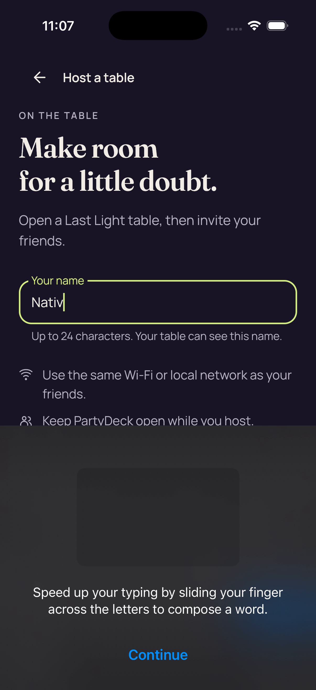
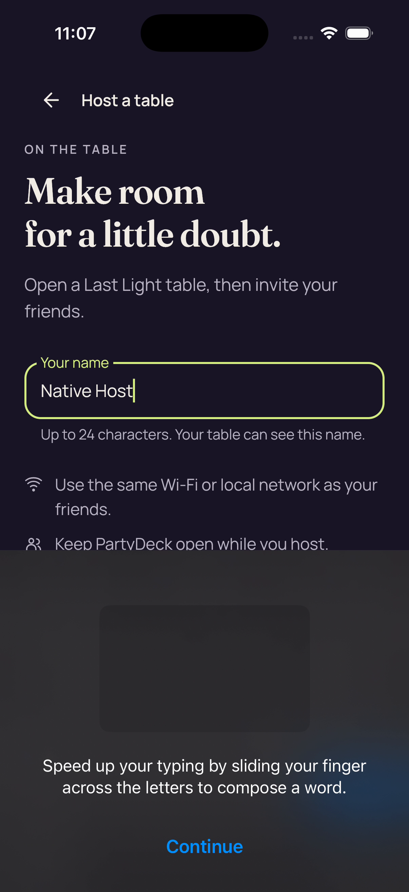

# iOS Host-name failure — retained video frames

The original Host-name assertion failed: Gues did not equal Native Host. Later reviewed pixels show Native Host; they do not overturn the failed assertion. Five direct frame views, seven additional attributed peer identities and 72 unviewed retained frames. Original packet PTS has no established UTC/XCTest anchor.

Exact source: `dd6df8a530d71b51ae4c3b0f4a05246f2e58402f`. Platform: iPhone 17 Simulator, decoded original recording.

**84 images**: 7 attributed peer direct frame view; 5 direct decoded-frame view; 72 preserved image; unviewed.

[Gallery index](../../README.md) · [Batch scope and review counts](../../provenance/20260911-4586/review-summary.json) · [Exact source paths, hashes and timestamps](../../provenance/20260911-4586/source-map.json).

The single original recording contains 259 source frames; one decode retained these 84 full-resolution PNGs. The original parser failure and corrected v3 packet/PTS binding are preserved. Guest appears before typing, Gues is visible in a reviewed intermediate frame, and later reviewed frames show Native Host. The keyboard tutorial leaves the name field visible while covering lower form content. Later pixels do not overturn the original failed equality assertion.

### Host-name failure retained frame 2

`retained-002.png` · 1206 × 2622 · 377,509 bytes.

SHA-256: `f1273faa050291b8c38c555e14d4f0882fbfb087884e6f02218871eb9f6f1e04`.

**[Attributed peer direct frame view](provenance/visual-review/review.json).** Attributed direct peer view; the frozen decoder review retains its observation.

Source frame 143; original packet PTS `5610/600`. No UTC/XCTest anchor is asserted.

### Host-name failure retained frame 3

`retained-003.png` · 1206 × 2622 · 374,680 bytes.

SHA-256: `95c7a41a6666e0f01048a40ec6bea25f662ae2b279342a62faa06856b87ebb3a`.

**[Attributed peer direct frame view](provenance/visual-review/review.json).** Attributed direct peer view; the frozen decoder review retains its observation.

Source frame 144; original packet PTS `5618/600`. No UTC/XCTest anchor is asserted.

### Host-name failure retained frame 4

`retained-004.png` · 1206 × 2622 · 253,255 bytes.

SHA-256: `5493741542dea7c2238513f826a36a8ac3492432b31a3c54152dc370e9a8d5c5`.

**[Direct decoded-frame view](provenance/visual-review/review.json).** Host a table shows the full title, introductory copy, Your name field containing Guest, name-length helper, Wi-Fi/local-network instruction, Keep PartyDeck open instruction, and full Open the table button. The field has a muted border/label and no visible caret. No keyboard or onboarding sheet is visible. No text or control clipping is visible in this complete initial form.

Source frame 148; original packet PTS `10047/600`. No UTC/XCTest anchor is asserted.

### Host-name failure retained frame 6

`retained-006.png` · 1206 × 2622 · 463,456 bytes.

SHA-256: `0065bf2e433988b6c8fc603e99b8ea1453b0f6aae7aee947467dd01190ad51ba`.

**[Attributed peer direct frame view](provenance/visual-review/review.json).** Attributed direct peer view; the frozen decoder review retains its observation.

Source frame 176; original packet PTS `11068/600`. No UTC/XCTest anchor is asserted.

### Host-name failure retained frame 7

`retained-007.png` · 1206 × 2622 · 462,628 bytes.

SHA-256: `dccccf5411e8d2ef49426fd8b9166df3488d7a49d303d3b71d5584ff232bb6d6`.

**[Attributed peer direct frame view](provenance/visual-review/review.json).** Attributed direct peer view; the frozen decoder review retains its observation.

Source frame 182; original packet PTS `12247/600`. No UTC/XCTest anchor is asserted.

### Host-name failure retained frame 8

`retained-008.png` · 1206 × 2622 · 462,670 bytes.

SHA-256: `2da1decd7b8ab22dd8b67a4c2a8ce93644b84fe73a7193910fabfaef979eb56e`.

**[Attributed peer direct frame view](provenance/visual-review/review.json).** Attributed direct peer view; the frozen decoder review retains its observation.

Source frame 183; original packet PTS `12266/600`. No UTC/XCTest anchor is asserted.

### Host-name failure retained frame 12

`retained-012.png` · 1206 × 2622 · 463,017 bytes.

SHA-256: `0bd7346bdde1f586959633d4cc3d21e27bfefb4172bde57e463ae55f5b0448ee`.

**[Direct decoded-frame view](provenance/visual-review/review.json).** Your name visibly contains Guest with a caret after the final t. The label and border are lime-colored. The full field and its helper remain above the lower overlay. An iOS keyboard tutorial sheet fills the lower viewport: Speed up your typing by sliding your finger across the letters to compose a word., with a blue Continue control. Normal letter keys are not visible. The lower Keep PartyDeck open instruction is cut at the sheet edge and Open the table is covered. These pixels do not establish an app viewport defect or whether scrolling would expose the action.

Source frame 187; original packet PTS `12809/600`. No UTC/XCTest anchor is asserted.

### Host-name failure retained frame 40

`retained-040.png` · 1206 × 2622 · 470,109 bytes.

SHA-256: `df411c5e9760733ce2becee5f18e6fa55c4cc78a6a45fefbad65e328db9ddbdd`.

**[Direct decoded-frame view](provenance/visual-review/review.json).** The full Your name field visibly contains Gues with the caret immediately after s, with lime-colored label and outline. The keyboard slide-typing tutorial text and blue Continue remain below the field. Normal letter keys and the Open the table action are not visible.

Source frame 215; original packet PTS `14899/600`. No UTC/XCTest anchor is asserted.

### Host-name failure retained frame 53

`retained-053.png` · 1206 × 2622 · 458,304 bytes.

SHA-256: `c84c69a580e9d56188b51a915aa03361358976218db46dbeb65b378c7bfce219`.

**[Direct decoded-frame view](provenance/visual-review/review.json).** The full Your name field visibly contains Native Host with the caret immediately after the last t, with lime-colored label and outline. The keyboard slide-typing tutorial text and blue Continue remain below the field. Normal letter keys and the Open the table action are not visible.

Source frame 228; original packet PTS `15283/600`. No UTC/XCTest anchor is asserted.

### Host-name failure retained frame 65

`retained-065.png` · 1206 × 2622 · 477,570 bytes.

SHA-256: `fcdbf1069a950fbdb82e47fa49be0ea9da441909b9190d1453475d38e409e4df`.

**[Attributed peer direct frame view](provenance/visual-review/review.json).** Attributed direct peer view; the frozen decoder review retains its observation.

Source frame 240; original packet PTS `15519/600`. No UTC/XCTest anchor is asserted.

### Host-name failure retained frame 78

`retained-078.png` · 1206 × 2622 · 473,049 bytes.

SHA-256: `e9ef454c59c52da2d3e5ff469e863422f607873204d9bab107a3aef5a3c94e84`.

**[Attributed peer direct frame view](provenance/visual-review/review.json).** Attributed direct peer view; the frozen decoder review retains its observation.

Source frame 253; original packet PTS `15708/600`. No UTC/XCTest anchor is asserted.

### Host-name failure retained frame 83

`retained-083.png` · 1206 × 2622 · 473,085 bytes.

SHA-256: `448810973f138e13475ebbdb5e371cf331d9f02d7b61cbd93b42a8efac31bf5d`.

**[Direct decoded-frame view](provenance/visual-review/review.json).** Your name visibly contains Native Host with a caret after the final t. The label and border remain lime-colored. The same keyboard tutorial text and blue Continue control remain visible in the lower sheet; normal letter keys remain absent. This later decoded frame shows the requested replacement text. The tutorial overlay cannot be described as a permanent typing block on the basis of these images.

Source frame 258; original packet PTS `15906/600`. No UTC/XCTest anchor is asserted.

### Host-name failure retained frame 0

`retained-000.png` · 1206 × 2622 · 492,823 bytes.

SHA-256: `a7afe50a7b24b0776486ee537af993240a1721add8cd638f677bee5f24b96f05`.

**[Preserved image; unviewed](provenance/visual-review/review.json).** Retained original-size derivative not viewed by these reviewers. No pixel finding is asserted.

Source frame 0; original packet PTS `0/600`. No UTC/XCTest anchor is asserted.

### Host-name failure retained frame 1

`retained-001.png` · 1206 × 2622 · 1,487,868 bytes.

SHA-256: `f9e3066cc29a9b80424ffe703f9901ed42f282d4b9144e2d833fedaf9aa9ea53`.

**[Preserved image; unviewed](provenance/visual-review/review.json).** Retained original-size derivative not viewed by these reviewers. No pixel finding is asserted.

Source frame 1; original packet PTS `1410/600`. No UTC/XCTest anchor is asserted.

### Host-name failure retained frame 5

`retained-005.png` · 1206 × 2622 · 268,030 bytes.

SHA-256: `62f5792757c9d1ff459ee05f36c4143b29da7823d4ae7a41708dc613c18a97db`.

**[Preserved image; unviewed](provenance/visual-review/review.json).** Retained original-size derivative not viewed by these reviewers. No pixel finding is asserted.

Source frame 156; original packet PTS `10749/600`. No UTC/XCTest anchor is asserted.

### Host-name failure retained frame 9

`retained-009.png` · 1206 × 2622 · 462,617 bytes.

SHA-256: `6799d847f53369b8bca37d27adb0a1be5af5b5b6e9db0cd76c08580f319df8ad`.

**[Preserved image; unviewed](provenance/visual-review/review.json).** Retained original-size derivative not viewed by these reviewers. No pixel finding is asserted.

Source frame 184; original packet PTS `12339/600`. No UTC/XCTest anchor is asserted.

### Host-name failure retained frame 10

`retained-010.png` · 1206 × 2622 · 462,988 bytes.

SHA-256: `19a1a8a17e21ccb58ae4c84d569c71051a94e432d11bf88cc0eab2c213d5b931`.

**[Preserved image; unviewed](provenance/visual-review/review.json).** Retained original-size derivative not viewed by these reviewers. No pixel finding is asserted.

Source frame 185; original packet PTS `12795/600`. No UTC/XCTest anchor is asserted.

### Host-name failure retained frame 11

`retained-011.png` · 1206 × 2622 · 462,821 bytes.

SHA-256: `ed323d652160eae2eaaeb9f8b2f2f71500827f63dcd8098da29d07278b85f3ef`.

**[Preserved image; unviewed](provenance/visual-review/review.json).** Retained original-size derivative not viewed by these reviewers. No pixel finding is asserted.

Source frame 186; original packet PTS `12802/600`. No UTC/XCTest anchor is asserted.

### Host-name failure retained frame 13

`retained-013.png` · 1206 × 2622 · 462,263 bytes.

SHA-256: `0826b644367d33b10069c642bdb6405a86170faed4c36a2cf94f30158ce991d1`.

**[Preserved image; unviewed](provenance/visual-review/review.json).** Retained original-size derivative not viewed by these reviewers. No pixel finding is asserted.

Source frame 188; original packet PTS `13100/600`. No UTC/XCTest anchor is asserted.

### Host-name failure retained frame 14

`retained-014.png` · 1206 × 2622 · 462,421 bytes.

SHA-256: `006d0f77869eedbd59102bee5092c57573ddc7ea06d84fd8ebcef2de253ad60a`.

**[Preserved image; unviewed](provenance/visual-review/review.json).** Retained original-size derivative not viewed by these reviewers. No pixel finding is asserted.

Source frame 189; original packet PTS `14458/600`. No UTC/XCTest anchor is asserted.

### Host-name failure retained frame 15

`retained-015.png` · 1206 × 2622 · 461,865 bytes.

SHA-256: `be61bd53111324022ae820a70d9922bdc35b78da755d2338a799456049339533`.

**[Preserved image; unviewed](provenance/visual-review/review.json).** Retained original-size derivative not viewed by these reviewers. No pixel finding is asserted.

Source frame 190; original packet PTS `14479/600`. No UTC/XCTest anchor is asserted.

### Host-name failure retained frame 16

`retained-016.png` · 1206 × 2622 · 461,774 bytes.

SHA-256: `6449a95812a2ff848dfd17b115954056a30ae418672f800d5195bf5b64675011`.

**[Preserved image; unviewed](provenance/visual-review/review.json).** Retained original-size derivative not viewed by these reviewers. No pixel finding is asserted.

Source frame 191; original packet PTS `14482/600`. No UTC/XCTest anchor is asserted.

### Host-name failure retained frame 17

`retained-017.png` · 1206 × 2622 · 460,917 bytes.

SHA-256: `655d1c82151fe7152d4522a66cefd682da45bc68a60b55aedae79e6bdc323f24`.

**[Preserved image; unviewed](provenance/visual-review/review.json).** Retained original-size derivative not viewed by these reviewers. No pixel finding is asserted.

Source frame 192; original packet PTS `14484/600`. No UTC/XCTest anchor is asserted.

### Host-name failure retained frame 18

`retained-018.png` · 1206 × 2622 · 462,691 bytes.

SHA-256: `d108e965c9c740457f506272b916ffef99e255ed78a40afac599f56c0e9a644d`.

**[Preserved image; unviewed](provenance/visual-review/review.json).** Retained original-size derivative not viewed by these reviewers. No pixel finding is asserted.

Source frame 193; original packet PTS `14487/600`. No UTC/XCTest anchor is asserted.

### Host-name failure retained frame 19

`retained-019.png` · 1206 × 2622 · 462,143 bytes.

SHA-256: `5845e3d8c78de412ee3c89a2716edb51057aea7942a48b5ca321aee2b9406831`.

**[Preserved image; unviewed](provenance/visual-review/review.json).** Retained original-size derivative not viewed by these reviewers. No pixel finding is asserted.

Source frame 194; original packet PTS `14499/600`. No UTC/XCTest anchor is asserted.

### Host-name failure retained frame 20

`retained-020.png` · 1206 × 2622 · 463,801 bytes.

SHA-256: `84b03e3da7dd7571245c89abe880cec920bcb86509e4c69a9a92ba501dfadcf6`.

**[Preserved image; unviewed](provenance/visual-review/review.json).** Retained original-size derivative not viewed by these reviewers. No pixel finding is asserted.

Source frame 195; original packet PTS `14514/600`. No UTC/XCTest anchor is asserted.

### Host-name failure retained frame 21

`retained-021.png` · 1206 × 2622 · 463,957 bytes.

SHA-256: `9c59ee89ccaa3b1326bd13f3c18b1c4d55826ef0765bacf90ef4ab18ea448577`.

**[Preserved image; unviewed](provenance/visual-review/review.json).** Retained original-size derivative not viewed by these reviewers. No pixel finding is asserted.

Source frame 196; original packet PTS `14533/600`. No UTC/XCTest anchor is asserted.

### Host-name failure retained frame 22

`retained-022.png` · 1206 × 2622 · 465,900 bytes.

SHA-256: `bc00c874e7796cd20f3ed649bd10686a59b889806f5d2c93c03f08e39278eb5a`.

**[Preserved image; unviewed](provenance/visual-review/review.json).** Retained original-size derivative not viewed by these reviewers. No pixel finding is asserted.

Source frame 197; original packet PTS `14544/600`. No UTC/XCTest anchor is asserted.

### Host-name failure retained frame 23

`retained-023.png` · 1206 × 2622 · 465,876 bytes.

SHA-256: `40f0e041c3faf11d7e3d9e2a3b125dc39f391a00f91eb846185746a435576cda`.

**[Preserved image; unviewed](provenance/visual-review/review.json).** Retained original-size derivative not viewed by these reviewers. No pixel finding is asserted.

Source frame 198; original packet PTS `14564/600`. No UTC/XCTest anchor is asserted.

### Host-name failure retained frame 24

`retained-024.png` · 1206 × 2622 · 465,958 bytes.

SHA-256: `fa655f7a9e3e67f686148b82523116b225943e4b861de1448ec0a63ba84693b9`.

**[Preserved image; unviewed](provenance/visual-review/review.json).** Retained original-size derivative not viewed by these reviewers. No pixel finding is asserted.

Source frame 199; original packet PTS `14574/600`. No UTC/XCTest anchor is asserted.

### Host-name failure retained frame 25

`retained-025.png` · 1206 × 2622 · 464,756 bytes.

SHA-256: `cda84db16596e19a92302f2e4ca4291600189b25eda106c5c4ccd6a15b29cdf1`.

**[Preserved image; unviewed](provenance/visual-review/review.json).** Retained original-size derivative not viewed by these reviewers. No pixel finding is asserted.

Source frame 200; original packet PTS `14585/600`. No UTC/XCTest anchor is asserted.

### Host-name failure retained frame 26

`retained-026.png` · 1206 × 2622 · 473,442 bytes.

SHA-256: `d2f5503258973ceb2e02cc90db27d9eab578ea75ad80785f7cbb6963bb8fbc0e`.

**[Preserved image; unviewed](provenance/visual-review/review.json).** Retained original-size derivative not viewed by these reviewers. No pixel finding is asserted.

Source frame 201; original packet PTS `14604/600`. No UTC/XCTest anchor is asserted.

### Host-name failure retained frame 27

`retained-027.png` · 1206 × 2622 · 470,462 bytes.

SHA-256: `43ec0ef5a8b12fdd0be37075213de6c7a0dc6fd92d5ce5a48a88d02e1b93bcc3`.

**[Preserved image; unviewed](provenance/visual-review/review.json).** Retained original-size derivative not viewed by these reviewers. No pixel finding is asserted.

Source frame 202; original packet PTS `14613/600`. No UTC/XCTest anchor is asserted.

### Host-name failure retained frame 28

`retained-028.png` · 1206 × 2622 · 470,691 bytes.

SHA-256: `894777c8400b9c681971731b611161d118096ea56a195b4f803d5f0d550036e4`.

**[Preserved image; unviewed](provenance/visual-review/review.json).** Retained original-size derivative not viewed by these reviewers. No pixel finding is asserted.

Source frame 203; original packet PTS `14624/600`. No UTC/XCTest anchor is asserted.

### Host-name failure retained frame 29

`retained-029.png` · 1206 × 2622 · 470,775 bytes.

SHA-256: `d42500fe33a69addca0227a125db6931e03bfcaffad678536a5b35b39133c5a8`.

**[Preserved image; unviewed](provenance/visual-review/review.json).** Retained original-size derivative not viewed by these reviewers. No pixel finding is asserted.

Source frame 204; original packet PTS `14638/600`. No UTC/XCTest anchor is asserted.

### Host-name failure retained frame 30

`retained-030.png` · 1206 × 2622 · 471,390 bytes.

SHA-256: `c59a0d0954e4fb654b52d7c11b31abf0bc35fd82596efe25daa3a744597a0026`.

**[Preserved image; unviewed](provenance/visual-review/review.json).** Retained original-size derivative not viewed by these reviewers. No pixel finding is asserted.

Source frame 205; original packet PTS `14665/600`. No UTC/XCTest anchor is asserted.

### Host-name failure retained frame 31

`retained-031.png` · 1206 × 2622 · 470,812 bytes.

SHA-256: `233e586e04741dbae37fd7f8d7b167480f819d3fb812ba03c2cece7c007fbced`.

**[Preserved image; unviewed](provenance/visual-review/review.json).** Retained original-size derivative not viewed by these reviewers. No pixel finding is asserted.

Source frame 206; original packet PTS `14692/600`. No UTC/XCTest anchor is asserted.

### Host-name failure retained frame 32

`retained-032.png` · 1206 × 2622 · 470,905 bytes.

SHA-256: `4b85e30026a4d7432d0a30ce26ab19a207bbddcfee7339c9aa711c8d4889db77`.

**[Preserved image; unviewed](provenance/visual-review/review.json).** Retained original-size derivative not viewed by these reviewers. No pixel finding is asserted.

Source frame 207; original packet PTS `14718/600`. No UTC/XCTest anchor is asserted.

### Host-name failure retained frame 33

`retained-033.png` · 1206 × 2622 · 470,839 bytes.

SHA-256: `a5f4efc3365f91ad88c8fd58fbd64f2e265a04f080151721fe84435db1f6a925`.

**[Preserved image; unviewed](provenance/visual-review/review.json).** Retained original-size derivative not viewed by these reviewers. No pixel finding is asserted.

Source frame 208; original packet PTS `14745/600`. No UTC/XCTest anchor is asserted.

### Host-name failure retained frame 34

`retained-034.png` · 1206 × 2622 · 470,518 bytes.

SHA-256: `792f0682e976d482681c77c8167d1ef07c6984ad19731825eb94ce1fbf6f8079`.

**[Preserved image; unviewed](provenance/visual-review/review.json).** Retained original-size derivative not viewed by these reviewers. No pixel finding is asserted.

Source frame 209; original packet PTS `14772/600`. No UTC/XCTest anchor is asserted.

### Host-name failure retained frame 35

`retained-035.png` · 1206 × 2622 · 470,449 bytes.

SHA-256: `54ead7697efe363d78785dfe8c746d8aeb1ac46ae177a4285786b6ced486e845`.

**[Preserved image; unviewed](provenance/visual-review/review.json).** Retained original-size derivative not viewed by these reviewers. No pixel finding is asserted.

Source frame 210; original packet PTS `14798/600`. No UTC/XCTest anchor is asserted.

### Host-name failure retained frame 36

`retained-036.png` · 1206 × 2622 · 470,284 bytes.

SHA-256: `a99d4f153e04dba486e549ef4e84046777a8220f9e04f4195b638ab9dca6f6c2`.

**[Preserved image; unviewed](provenance/visual-review/review.json).** Retained original-size derivative not viewed by these reviewers. No pixel finding is asserted.

Source frame 211; original packet PTS `14825/600`. No UTC/XCTest anchor is asserted.

### Host-name failure retained frame 37

`retained-037.png` · 1206 × 2622 · 470,219 bytes.

SHA-256: `04ceb15ff9693aaa407ae5f4b5f3bad05cd73f30b5ad380122dc2d78190abcaf`.

**[Preserved image; unviewed](provenance/visual-review/review.json).** Retained original-size derivative not viewed by these reviewers. No pixel finding is asserted.

Source frame 212; original packet PTS `14855/600`. No UTC/XCTest anchor is asserted.

### Host-name failure retained frame 38

`retained-038.png` · 1206 × 2622 · 470,214 bytes.

SHA-256: `647079123aa2d824f597599d4c90d4bbbec71a3a6e54713b33e98eb25203a204`.

**[Preserved image; unviewed](provenance/visual-review/review.json).** Retained original-size derivative not viewed by these reviewers. No pixel finding is asserted.

Source frame 213; original packet PTS `14864/600`. No UTC/XCTest anchor is asserted.

### Host-name failure retained frame 39

`retained-039.png` · 1206 × 2622 · 470,170 bytes.

SHA-256: `6326234ba8e23a8e2bab5f64a834395246a306eb3e6d9f4972e0755fc34ba4d2`.

**[Preserved image; unviewed](provenance/visual-review/review.json).** Retained original-size derivative not viewed by these reviewers. No pixel finding is asserted.

Source frame 214; original packet PTS `14885/600`. No UTC/XCTest anchor is asserted.

### Host-name failure retained frame 41

`retained-041.png` · 1206 × 2622 · 469,688 bytes.

SHA-256: `0e1ae0f08af4c84244a2551e0fcfee292a1b63ec0be6474d29378d33f6883dca`.

**[Preserved image; unviewed](provenance/visual-review/review.json).** Retained original-size derivative not viewed by these reviewers. No pixel finding is asserted.

Source frame 216; original packet PTS `14916/600`. No UTC/XCTest anchor is asserted.

### Host-name failure retained frame 42

`retained-042.png` · 1206 × 2622 · 468,395 bytes.

SHA-256: `401a0b67e964d35d8eda53ab3dba1e0e08840181a89f4fe0655e0902a0f9c3d2`.

**[Preserved image; unviewed](provenance/visual-review/review.json).** Retained original-size derivative not viewed by these reviewers. No pixel finding is asserted.

Source frame 217; original packet PTS `15025/600`. No UTC/XCTest anchor is asserted.

### Host-name failure retained frame 43

`retained-043.png` · 1206 × 2622 · 456,906 bytes.

SHA-256: `8153e6e28ff38793bf271046a0272ec7dc1e45a7cab69c392c391996151eeabf`.

**[Preserved image; unviewed](provenance/visual-review/review.json).** Retained original-size derivative not viewed by these reviewers. No pixel finding is asserted.

Source frame 218; original packet PTS `15189/600`. No UTC/XCTest anchor is asserted.

### Host-name failure retained frame 44

`retained-044.png` · 1206 × 2622 · 454,906 bytes.

SHA-256: `eb2bfc60dc3efe0d7abd37dfd1057928c4c7ff54214c0df855583ba955a780a3`.

**[Preserved image; unviewed](provenance/visual-review/review.json).** Retained original-size derivative not viewed by these reviewers. No pixel finding is asserted.

Source frame 219; original packet PTS `15208/600`. No UTC/XCTest anchor is asserted.

### Host-name failure retained frame 45

`retained-045.png` · 1206 × 2622 · 457,329 bytes.

SHA-256: `559c757f8472f44b08fdb7db658806980c06186ff3390b15f07c7f0fbd1be4ad`.

**[Preserved image; unviewed](provenance/visual-review/review.json).** Retained original-size derivative not viewed by these reviewers. No pixel finding is asserted.

Source frame 220; original packet PTS `15230/600`. No UTC/XCTest anchor is asserted.

### Host-name failure retained frame 46

`retained-046.png` · 1206 × 2622 · 451,670 bytes.

SHA-256: `25454138b2e33559982248b219b55d7fea49e1226aeee7f2de3d786336249987`.

**[Preserved image; unviewed](provenance/visual-review/review.json).** Retained original-size derivative not viewed by these reviewers. No pixel finding is asserted.

Source frame 221; original packet PTS `15245/600`. No UTC/XCTest anchor is asserted.

### Host-name failure retained frame 47

`retained-047.png` · 1206 × 2622 · 452,368 bytes.

SHA-256: `66079380e4c66008990cc02b9e2198aeb2542b23817e0b0d261de9d2299c3825`.

**[Preserved image; unviewed](provenance/visual-review/review.json).** Retained original-size derivative not viewed by these reviewers. No pixel finding is asserted.

Source frame 222; original packet PTS `15246/600`. No UTC/XCTest anchor is asserted.

### Host-name failure retained frame 48

`retained-048.png` · 1206 × 2622 · 452,333 bytes.

SHA-256: `367a0b7039ece0434aab7a83d416c1f551442ec78f3a828b8b10e08d4910c463`.

**[Preserved image; unviewed](provenance/visual-review/review.json).** Retained original-size derivative not viewed by these reviewers. No pixel finding is asserted.

Source frame 223; original packet PTS `15248/600`. No UTC/XCTest anchor is asserted.

### Host-name failure retained frame 49

`retained-049.png` · 1206 × 2622 · 458,514 bytes.

SHA-256: `d6312d3f3d0041abc177a3140f50a09fc3cc4aa8f842059b28d93eccf0920627`.

**[Preserved image; unviewed](provenance/visual-review/review.json).** Retained original-size derivative not viewed by these reviewers. No pixel finding is asserted.

Source frame 224; original packet PTS `15252/600`. No UTC/XCTest anchor is asserted.

### Host-name failure retained frame 50

`retained-050.png` · 1206 × 2622 · 458,441 bytes.

SHA-256: `aa9e2e95405d9954ca4c967b8b1a62696c56d1224f9c9f459fb0e29aef31ffdc`.

**[Preserved image; unviewed](provenance/visual-review/review.json).** Retained original-size derivative not viewed by these reviewers. No pixel finding is asserted.

Source frame 225; original packet PTS `15265/600`. No UTC/XCTest anchor is asserted.

### Host-name failure retained frame 51

`retained-051.png` · 1206 × 2622 · 458,404 bytes.

SHA-256: `c16e8b5c9189647c15faf81a739234a2a9f6a8670e4675087c90e013e0d4ae1d`.

**[Preserved image; unviewed](provenance/visual-review/review.json).** Retained original-size derivative not viewed by these reviewers. No pixel finding is asserted.

Source frame 226; original packet PTS `15266/600`. No UTC/XCTest anchor is asserted.

### Host-name failure retained frame 52

`retained-052.png` · 1206 × 2622 · 458,293 bytes.

SHA-256: `5c49c44837c5809ae290d2958a6e7c22b85b17036a65bcaec0668cbc70c0fd5f`.

**[Preserved image; unviewed](provenance/visual-review/review.json).** Retained original-size derivative not viewed by these reviewers. No pixel finding is asserted.

Source frame 227; original packet PTS `15267/600`. No UTC/XCTest anchor is asserted.

### Host-name failure retained frame 54

`retained-054.png` · 1206 × 2622 · 458,164 bytes.

SHA-256: `3b2d73e12b3ff63b24d5dfe5d03d185e718d8d44dd18caae010711bd98d3a8a2`.

**[Preserved image; unviewed](provenance/visual-review/review.json).** Retained original-size derivative not viewed by these reviewers. No pixel finding is asserted.

Source frame 229; original packet PTS `15291/600`. No UTC/XCTest anchor is asserted.

### Host-name failure retained frame 55

`retained-055.png` · 1206 × 2622 · 459,915 bytes.

SHA-256: `8629166ed35b5d9d27a3c2b7df74bd3f92d9dc7369d5ea517de68dbfe4883f5b`.

**[Preserved image; unviewed](provenance/visual-review/review.json).** Retained original-size derivative not viewed by these reviewers. No pixel finding is asserted.

Source frame 230; original packet PTS `15395/600`. No UTC/XCTest anchor is asserted.

### Host-name failure retained frame 56

`retained-056.png` · 1206 × 2622 · 458,820 bytes.

SHA-256: `7697d9d16b3b1bf0c6c72b224c81a89dedddc3a10c982898d5282af107f734d0`.

**[Preserved image; unviewed](provenance/visual-review/review.json).** Retained original-size derivative not viewed by these reviewers. No pixel finding is asserted.

Source frame 231; original packet PTS `15408/600`. No UTC/XCTest anchor is asserted.

### Host-name failure retained frame 57

`retained-057.png` · 1206 × 2622 · 462,294 bytes.

SHA-256: `50f3dcf037cc8777824e443148087db72253d0a654bd4643f3d8f755bf0c6596`.

**[Preserved image; unviewed](provenance/visual-review/review.json).** Retained original-size derivative not viewed by these reviewers. No pixel finding is asserted.

Source frame 232; original packet PTS `15413/600`. No UTC/XCTest anchor is asserted.

### Host-name failure retained frame 58

`retained-058.png` · 1206 × 2622 · 462,068 bytes.

SHA-256: `f570a4d9c283f175500951b001745da288d8f696aac2c98910ab873588bf4c65`.

**[Preserved image; unviewed](provenance/visual-review/review.json).** Retained original-size derivative not viewed by these reviewers. No pixel finding is asserted.

Source frame 233; original packet PTS `15418/600`. No UTC/XCTest anchor is asserted.

### Host-name failure retained frame 59

`retained-059.png` · 1206 × 2622 · 461,544 bytes.

SHA-256: `0d747629989a828ca7697b7042b1723118e4da58826844acf5c51c73904f3943`.

**[Preserved image; unviewed](provenance/visual-review/review.json).** Retained original-size derivative not viewed by these reviewers. No pixel finding is asserted.

Source frame 234; original packet PTS `15419/600`. No UTC/XCTest anchor is asserted.

### Host-name failure retained frame 60

`retained-060.png` · 1206 × 2622 · 469,205 bytes.

SHA-256: `9609a577856d33e858d71bb6660cc8df0a277b62353521e22e534d4129c2691f`.

**[Preserved image; unviewed](provenance/visual-review/review.json).** Retained original-size derivative not viewed by these reviewers. No pixel finding is asserted.

Source frame 235; original packet PTS `15434/600`. No UTC/XCTest anchor is asserted.

### Host-name failure retained frame 61

`retained-061.png` · 1206 × 2622 · 468,999 bytes.

SHA-256: `ff9041c0b6761dcfd4f7a822df0f02551e6fd51b738d13b54190fa2e48a745da`.

**[Preserved image; unviewed](provenance/visual-review/review.json).** Retained original-size derivative not viewed by these reviewers. No pixel finding is asserted.

Source frame 236; original packet PTS `15439/600`. No UTC/XCTest anchor is asserted.

### Host-name failure retained frame 62

`retained-062.png` · 1206 × 2622 · 470,432 bytes.

SHA-256: `74c3ed3152aeae423b8a91f95be70219ee863204d0b8a997d48711239f34a56f`.

**[Preserved image; unviewed](provenance/visual-review/review.json).** Retained original-size derivative not viewed by these reviewers. No pixel finding is asserted.

Source frame 237; original packet PTS `15448/600`. No UTC/XCTest anchor is asserted.

### Host-name failure retained frame 63

`retained-063.png` · 1206 × 2622 · 467,094 bytes.

SHA-256: `7390215d67f6d0cd4b31bc0d9a746c0a558c67d492a83d2f4b88e32f7df55504`.

**[Preserved image; unviewed](provenance/visual-review/review.json).** Retained original-size derivative not viewed by these reviewers. No pixel finding is asserted.

Source frame 238; original packet PTS `15467/600`. No UTC/XCTest anchor is asserted.

### Host-name failure retained frame 64

`retained-064.png` · 1206 × 2622 · 473,573 bytes.

SHA-256: `3909cceaa8c9082097034cf26461167f91a8f21b43b0fa7b109860f0dd3ffda3`.

**[Preserved image; unviewed](provenance/visual-review/review.json).** Retained original-size derivative not viewed by these reviewers. No pixel finding is asserted.

Source frame 239; original packet PTS `15486/600`. No UTC/XCTest anchor is asserted.

### Host-name failure retained frame 66

`retained-066.png` · 1206 × 2622 · 477,371 bytes.

SHA-256: `49c61e235116a4396e17f8c0deec6a35c78394c132aed1da06d92cc217c2ae36`.

**[Preserved image; unviewed](provenance/visual-review/review.json).** Retained original-size derivative not viewed by these reviewers. No pixel finding is asserted.

Source frame 241; original packet PTS `15546/600`. No UTC/XCTest anchor is asserted.

### Host-name failure retained frame 67

`retained-067.png` · 1206 × 2622 · 470,034 bytes.

SHA-256: `19ee210a4c778e0a9a8b4887a0dbd3dba3e6c9b39b7fe5af938e38c6568be9d3`.

**[Preserved image; unviewed](provenance/visual-review/review.json).** Retained original-size derivative not viewed by these reviewers. No pixel finding is asserted.

Source frame 242; original packet PTS `15569/600`. No UTC/XCTest anchor is asserted.

### Host-name failure retained frame 68

`retained-068.png` · 1206 × 2622 · 472,542 bytes.

SHA-256: `3d2a4c12b4613dbda37588dc291397fe04f1b71c641d670eb6954bd3a93f0d75`.

**[Preserved image; unviewed](provenance/visual-review/review.json).** Retained original-size derivative not viewed by these reviewers. No pixel finding is asserted.

Source frame 243; original packet PTS `15621/600`. No UTC/XCTest anchor is asserted.

### Host-name failure retained frame 69

`retained-069.png` · 1206 × 2622 · 472,345 bytes.

SHA-256: `919f58caf17ca2fdf7649efac6e33973cbe69b3ad47972677e6b110598c6e1e4`.

**[Preserved image; unviewed](provenance/visual-review/review.json).** Retained original-size derivative not viewed by these reviewers. No pixel finding is asserted.

Source frame 244; original packet PTS `15640/600`. No UTC/XCTest anchor is asserted.

### Host-name failure retained frame 70

`retained-070.png` · 1206 × 2622 · 472,554 bytes.

SHA-256: `3f7df98261656b3005712806a6e49f69b8cbb3713bb89b3c3bb232ffdbab8dd0`.

**[Preserved image; unviewed](provenance/visual-review/review.json).** Retained original-size derivative not viewed by these reviewers. No pixel finding is asserted.

Source frame 245; original packet PTS `15650/600`. No UTC/XCTest anchor is asserted.

### Host-name failure retained frame 71

`retained-071.png` · 1206 × 2622 · 472,383 bytes.

SHA-256: `c0b0c65269464d25f6fcffac82e2f6fefc9b7e15a6495ada89a50220c17ca628`.

**[Preserved image; unviewed](provenance/visual-review/review.json).** Retained original-size derivative not viewed by these reviewers. No pixel finding is asserted.

Source frame 246; original packet PTS `15655/600`. No UTC/XCTest anchor is asserted.

### Host-name failure retained frame 72

`retained-072.png` · 1206 × 2622 · 473,016 bytes.

SHA-256: `a2dd3bc2759185072dff5a9f3bdf96e7538ae225a68eb7c81c782ae4fde4fc67`.

**[Preserved image; unviewed](provenance/visual-review/review.json).** Retained original-size derivative not viewed by these reviewers. No pixel finding is asserted.

Source frame 247; original packet PTS `15656/600`. No UTC/XCTest anchor is asserted.

### Host-name failure retained frame 73

`retained-073.png` · 1206 × 2622 · 472,839 bytes.

SHA-256: `0d34ae2208ea51b20930351f78e589018c12da55ad9ecef7fbb472a97036fcf0`.

**[Preserved image; unviewed](provenance/visual-review/review.json).** Retained original-size derivative not viewed by these reviewers. No pixel finding is asserted.

Source frame 248; original packet PTS `15657/600`. No UTC/XCTest anchor is asserted.

### Host-name failure retained frame 74

`retained-074.png` · 1206 × 2622 · 473,136 bytes.

SHA-256: `d0680368d51c074d483a7b2714584e62f586677fdd44361618f72a3ec6e5dff2`.

**[Preserved image; unviewed](provenance/visual-review/review.json).** Retained original-size derivative not viewed by these reviewers. No pixel finding is asserted.

Source frame 249; original packet PTS `15660/600`. No UTC/XCTest anchor is asserted.

### Host-name failure retained frame 75

`retained-075.png` · 1206 × 2622 · 472,807 bytes.

SHA-256: `12a9be80e472a2c5d09b794c3be37f162c242adde9b960c65f0f0d46dd80282a`.

**[Preserved image; unviewed](provenance/visual-review/review.json).** Retained original-size derivative not viewed by these reviewers. No pixel finding is asserted.

Source frame 250; original packet PTS `15662/600`. No UTC/XCTest anchor is asserted.

### Host-name failure retained frame 76

`retained-076.png` · 1206 × 2622 · 473,123 bytes.

SHA-256: `8fc1d89345080ce53d04d784c5fafeee1ad0a476ca84ab91f9f8798c1e44fa17`.

**[Preserved image; unviewed](provenance/visual-review/review.json).** Retained original-size derivative not viewed by these reviewers. No pixel finding is asserted.

Source frame 251; original packet PTS `15663/600`. No UTC/XCTest anchor is asserted.

### Host-name failure retained frame 77

`retained-077.png` · 1206 × 2622 · 472,812 bytes.

SHA-256: `511126f2ef0748913e4fc04681ceb2bce97f02a75c119161ff5c0ab242da86dd`.

**[Preserved image; unviewed](provenance/visual-review/review.json).** Retained original-size derivative not viewed by these reviewers. No pixel finding is asserted.

Source frame 252; original packet PTS `15675/600`. No UTC/XCTest anchor is asserted.

### Host-name failure retained frame 79

`retained-079.png` · 1206 × 2622 · 472,725 bytes.

SHA-256: `dba7d359d00869767e255e01511e03d9163502e75133e4cd66df2b64184160f8`.

**[Preserved image; unviewed](provenance/visual-review/review.json).** Retained original-size derivative not viewed by these reviewers. No pixel finding is asserted.

Source frame 254; original packet PTS `15733/600`. No UTC/XCTest anchor is asserted.

### Host-name failure retained frame 80

`retained-080.png` · 1206 × 2622 · 472,920 bytes.

SHA-256: `0cd9cba322e71c230efed92503eff6d14ab4e5d85445470313fccdac1e238003`.

**[Preserved image; unviewed](provenance/visual-review/review.json).** Retained original-size derivative not viewed by these reviewers. No pixel finding is asserted.

Source frame 255; original packet PTS `15823/600`. No UTC/XCTest anchor is asserted.

### Host-name failure retained frame 81

`retained-081.png` · 1206 × 2622 · 472,953 bytes.

SHA-256: `8530dd9b9997eb38f9e89ab807ae3d684262c54a4d738b03b59786856e280b8d`.

**[Preserved image; unviewed](provenance/visual-review/review.json).** Retained original-size derivative not viewed by these reviewers. No pixel finding is asserted.

Source frame 256; original packet PTS `15866/600`. No UTC/XCTest anchor is asserted.

### Host-name failure retained frame 82

`retained-082.png` · 1206 × 2622 · 473,226 bytes.

SHA-256: `8a3cbb8c193c2a112b095dd325390cc0c0df369c83e043bfc6cbe799b3fb9920`.

**[Preserved image; unviewed](provenance/visual-review/review.json).** Retained original-size derivative not viewed by these reviewers. No pixel finding is asserted.

Source frame 257; original packet PTS `15885/600`. No UTC/XCTest anchor is asserted.

Original media companions and review receipts

| Preserved file | Bytes | SHA-256 |
| --- | ---: | --- |
| [ios-34538972728-host-name-failure/decode/REVIEW.md](decode/REVIEW.md) | 4,427 | `9a86503920ba4ff2bcbd8cb2409b68168910d4ef3955202e1c1f0e06bb570a15` |
| [ios-34538972728-host-name-failure/decode/decode-execution.json](decode/decode-execution.json) | 2,188 | `ed8f02b1a1a11143452f327a562fd7d77153d1be905a307d3daaf2f0c15fa64c` |
| [ios-34538972728-host-name-failure/decode/decode-ffmpeg.stderr.txt](decode/decode-ffmpeg.stderr.txt) | 109,669 | `43e4e15bfc3aed56ba14a44b7961f0c3b0ff1d38822970d5dc6a07d7435f2d6d` |
| [ios-34538972728-host-name-failure/decode/decode-once.py](decode/decode-once.py) | 11,653 | `2d277aece275624eee2593667f48e604b40a0e42b35ca996ea4cf14d58e235d7` |
| [ios-34538972728-host-name-failure/decode/decode-plan.json](decode/decode-plan.json) | 873 | `c17779b3f0b6c8ec4f871b1d9c95a9487a3129114747f7602eab894ab37610a7` |
| [ios-34538972728-host-name-failure/decode/decode-start.json](decode/decode-start.json) | 3,770 | `62aaa047650e9b325d29d8b63d231a190abc3bf4ff39bc4f87d43cdef67ab71e` |
| [ios-34538972728-host-name-failure/decode/ffmpeg-version.stderr.txt](decode/ffmpeg-version.stderr.txt) | 0 | `e3b0c44298fc1c149afbf4c8996fb92427ae41e4649b934ca495991b7852b855` |
| [ios-34538972728-host-name-failure/decode/ffmpeg-version.txt](decode/ffmpeg-version.txt) | 1,838 | `5b320c97f515e79171f10a2147d875ffb6b14bd2b25681047b73c46fe0a527ee` |
| [ios-34538972728-host-name-failure/decode/ffprobe-version.stderr.txt](decode/ffprobe-version.stderr.txt) | 0 | `e3b0c44298fc1c149afbf4c8996fb92427ae41e4649b934ca495991b7852b855` |
| [ios-34538972728-host-name-failure/decode/ffprobe-version.txt](decode/ffprobe-version.txt) | 1,839 | `1b6410f756d8b5ef5308d712b51d2543bf8c8e6bc5796b7ede9570d099131e0b` |
| [ios-34538972728-host-name-failure/decode/frame-manifest-v2.json](decode/frame-manifest-v2.json) | 213,688 | `3382cb45be0a985ab71fe9357d8a9afe3c8f6773f25f30a84be57d342dca3523` |
| [ios-34538972728-host-name-failure/decode/frame-manifest-v3.json](decode/frame-manifest-v3.json) | 254,086 | `d637ca5b5bdc0c4ab8a8bd33c14179797c1d6a5c19d4fce11dde2c0fd2fa6c47` |
| [ios-34538972728-host-name-failure/decode/frame-manifest.json](decode/frame-manifest.json) | 192,301 | `b04fd9c23acc8e3ddce21966ddf28dfc8770fd1da70539a5f4a93e60dc3c5fa5` |
| [ios-34538972728-host-name-failure/decode/h264-picture-headers.json](decode/h264-picture-headers.json) | 157,971 | `f62e4adde6d288f33be34a0e081f29faf74225107e3282e6daba1815573ff86a` |
| [ios-34538972728-host-name-failure/decode/media-metadata.json](decode/media-metadata.json) | 2,969 | `8eb5fb3ae84645f3128cc7119847227e2cbe2a888f33197c0397375e2735ac26` |
| [ios-34538972728-host-name-failure/decode/media-metadata.stderr.txt](decode/media-metadata.stderr.txt) | 0 | `e3b0c44298fc1c149afbf4c8996fb92427ae41e4649b934ca495991b7852b855` |
| [ios-34538972728-host-name-failure/decode/original-packet-frame-binding.json](decode/original-packet-frame-binding.json) | 129,434 | `d0a748d56eb38afecbb882aae3c8512b1f261b54af7f247c44f4769fa80180dd` |
| [ios-34538972728-host-name-failure/decode/packet-header-verification.json](decode/packet-header-verification.json) | 529 | `140e8968c11e65cd1c44ae761a1744823dd72aadb207b242ec729020ce4e0281` |
| [ios-34538972728-host-name-failure/decode/pixel-checkpoint-freeze.json](decode/pixel-checkpoint-freeze.json) | 30,959 | `7ff5b02854e7e39033e46b5073dc560ee22dd664a6ac5f61ebdff5f031762708` |
| [ios-34538972728-host-name-failure/decode/probe-receipts.json](decode/probe-receipts.json) | 3,274 | `4346c47f68766fddd392e7a93e491296d33fb9905b6842de1b03989d32702a33` |
| [ios-34538972728-host-name-failure/decode/review.json](decode/review.json) | 42,228 | `486a51a96fd92f07b7feb0b68f730244fb56ca94e27767930cd1246e8e945288` |
| [ios-34538972728-host-name-failure/decode/source-context.json](decode/source-context.json) | 2,685 | `6654555b934fc28194d9b96ea7f1bbffaeef786f912a66468798ebf85b3b0d66` |
| [ios-34538972728-host-name-failure/decode/source-decoded-frame-index-v2.json](decode/source-decoded-frame-index-v2.json) | 60,084 | `67dff32b263ae5710a9dfff7078c7f0faf96a2bb469f8b35e5fe1edb579269f6` |
| [ios-34538972728-host-name-failure/decode/source-decoded-frame-index.json](decode/source-decoded-frame-index.json) | 169 | `5d9f258694c87b9c6d90b7f61f6dd43149c106df59db1282590526d6b545c5dc` |
| [ios-34538972728-host-name-failure/decode/upstream-ffmpeg-6.1.1/fftools_ffmpeg_dec.c](decode/upstream-ffmpeg-6.1.1/fftools_ffmpeg_dec.c) | 36,194 | `2d4ffddd4e52fbee3e64d3cd5a071973904144412fe712d43d33090e5104d82c` |
| [ios-34538972728-host-name-failure/decode/upstream-ffmpeg-6.1.1/libavcodec_decode.c](decode/upstream-ffmpeg-6.1.1/libavcodec_decode.c) | 62,909 | `102dad9f7be80c3698978180951400bef47870c562b530c15211091fb0f11700` |
| [ios-34538972728-host-name-failure/decode/upstream-ffmpeg-6.1.1/libavcodec_h264_parse.c](decode/upstream-ffmpeg-6.1.1/libavcodec_h264_parse.c) | 19,810 | `b17bd508e463f17205d40b034caa0830c433b1c5e0ba09a4e3b1f9abd1a3f951` |
| [ios-34538972728-host-name-failure/decode/upstream-ffmpeg-6.1.1/receipts.json](decode/upstream-ffmpeg-6.1.1/receipts.json) | 958 | `52a92ee02616a20e32f47d6bf2d354ba5077e46e5909a19609091cb6ee2563d3` |
| [ios-34538972728-host-name-failure/decode/verify-picture-metadata.py](decode/verify-picture-metadata.py) | 8,064 | `c40680dded3cea8aa5edcb3fcb411d7bf4cba3f3b064a8e10240b33059965ff8` |
| [ios-34538972728-host-name-failure/decode/video-packets.json](decode/video-packets.json) | 77,227 | `81bc29e523ea380fac8d70308adada0cc41acb07320182d14c1202f2f293814b` |
| [ios-34538972728-host-name-failure/decode/video-packets.stderr.txt](decode/video-packets.stderr.txt) | 0 | `e3b0c44298fc1c149afbf4c8996fb92427ae41e4649b934ca495991b7852b855` |
| [ios-34538972728-host-name-failure/decode/FROZEN.json](decode/FROZEN.json) | 18,990 | `d1415dedacb59d21724ef03db29976ba630159ffd5f94ac980259c071c82a31d` |
| [ios-34538972728-host-name-failure/provenance/visual-review/FROZEN.json](provenance/visual-review/FROZEN.json) | 2,142 | `b46ba24641dbb0939887036993576befd544067a2fae1c9502b5ea4b45939981` |
| [ios-34538972728-host-name-failure/provenance/visual-review/direct-views-01.json](provenance/visual-review/direct-views-01.json) | 4,872 | `5c6c085b2fbf72aa76b58cd04c9ed3b717a05ccb67012d7fbfbfd2b497f8092b` |
| [ios-34538972728-host-name-failure/provenance/visual-review/direct-views-02.json](provenance/visual-review/direct-views-02.json) | 2,691 | `554d95045e48c9ff92503514d359055c3d00023bac24f761dcdd2cb2c15f8664` |
| [ios-34538972728-host-name-failure/provenance/visual-review/frame-bindings-pre-review-v1.json](provenance/visual-review/frame-bindings-pre-review-v1.json) | 2,293 | `2967dd511eee4c9aca05f25432030ef3e37b77c35b86fcacc9e62de47cfde7a5` |
| [ios-34538972728-host-name-failure/provenance/visual-review/review.json](provenance/visual-review/review.json) | 114,038 | `e8530faaa33d83e443b7e9f24ea7a4bc9b54ce73a2c782caed1d8f1aef95f2dc` |
| [ios-34538972728-host-name-failure/provenance/visual-review/source-binding.json](provenance/visual-review/source-binding.json) | 5,793 | `0e597d3808856bfcd1f784cc26519fd5603fa337e89e6d069d3b7e4dd2d093cd` |
| [ios-34538972728-host-name-failure/provenance/event-source-review/authoritative/hasfocus-retrieval.json](provenance/event-source-review/authoritative/hasfocus-retrieval.json) | 516 | `267ae31726e27fd078bc695e7d7f99813ee7d6599b9eb3bdbaa595c6d724b47f` |
| [ios-34538972728-host-name-failure/provenance/event-source-review/authoritative/retrieval-manifest.json](provenance/event-source-review/authoritative/retrieval-manifest.json) | 2,219 | `4e263bb6e8da0be9cf5f8aa4b81bf3be38a63897ad0e98d2edefcb8e3fad772f` |
| [ios-34538972728-host-name-failure/provenance/event-source-review/authoritative/xcuielement-hasfocus.json](provenance/event-source-review/authoritative/xcuielement-hasfocus.json) | 11,445 | `ff533d5644fb24352a718af3585f435516768d698c6e70cc4a2ddd0a14253f6f` |
| [ios-34538972728-host-name-failure/provenance/event-source-review/authoritative/xcuielement-keyboardfocus.json](provenance/event-source-review/authoritative/xcuielement-keyboardfocus.json) | 34,690 | `9798e1aff866ea6d8ebf1f96afe674245d88f5c10051e821dce1b4b52e7b537a` |
| [ios-34538972728-host-name-failure/provenance/event-source-review/authoritative/xcuielement-typetext.json](provenance/event-source-review/authoritative/xcuielement-typetext.json) | 11,941 | `55647f2f5864498102ecb0539bff92ab631b439f4700b642c04792aa0557c1b8` |
| [ios-34538972728-host-name-failure/provenance/event-source-review/authoritative/xcuielement-waitforexistence.json](provenance/event-source-review/authoritative/xcuielement-waitforexistence.json) | 19,264 | `5a9fc618bdf01071a342e77d830476f9197612f5b6f35f8b3fd8d3f5366f97f1` |
| [ios-34538972728-host-name-failure/provenance/event-source-review/baseline/composeApp/src/commonMain/kotlin/dev/partydeck/app/controller/PartyDeckController.kt](provenance/event-source-review/baseline/composeApp/src/commonMain/kotlin/dev/partydeck/app/controller/PartyDeckController.kt) | 28,031 | `e677b03ffff11fa175f7ee6bba0af3dc2c49908db5872a87039d8376de5c7287` |
| [ios-34538972728-host-name-failure/provenance/event-source-review/baseline/composeApp/src/commonMain/kotlin/dev/partydeck/app/ui/shell/HostJoinScreen.kt](provenance/event-source-review/baseline/composeApp/src/commonMain/kotlin/dev/partydeck/app/ui/shell/HostJoinScreen.kt) | 9,917 | `a9fcca74197ab97d9cebb7e7a29a144bd326e6f74cbf01795f348341a2c991c2` |
| [ios-34538972728-host-name-failure/provenance/event-source-review/baseline/iosApp/PartyDeckUITests/PartyDeckUITests.swift](provenance/event-source-review/baseline/iosApp/PartyDeckUITests/PartyDeckUITests.swift) | 17,949 | `b332a3576d7b13fdcca082459f9dc0abc5cf8b1e7be5c68d2641e332dca66d17` |
| [ios-34538972728-host-name-failure/provenance/event-source-review/candidate/iosApp/PartyDeckUITests/PartyDeckUITests.swift](provenance/event-source-review/candidate/iosApp/PartyDeckUITests/PartyDeckUITests.swift) | 18,107 | `fcc57b669ca638da439b8a42d93d518d273b2df88b625e1dfe8408bc1d68f23d` |
| [ios-34538972728-host-name-failure/provenance/event-source-review/event-source-correlation.json](provenance/event-source-review/event-source-correlation.json) | 22,297 | `ec34fc539d501478604e07e9a8f41dc14c173956734c8c8140602434516292a9` |
| [ios-34538972728-host-name-failure/provenance/event-source-review/patch-replay/iosApp/PartyDeckUITests/PartyDeckUITests.swift](provenance/event-source-review/patch-replay/iosApp/PartyDeckUITests/PartyDeckUITests.swift) | 18,107 | `fcc57b669ca638da439b8a42d93d518d273b2df88b625e1dfe8408bc1d68f23d` |
| [ios-34538972728-host-name-failure/provenance/event-source-review/prior-success-source-comparison.json](provenance/event-source-review/prior-success-source-comparison.json) | 7,186 | `c7f017d8ad3c596bbfea097309800e266a752ffd5859ff3dc44b8aecc15bf751` |
| [ios-34538972728-host-name-failure/provenance/event-source-review/proposal.freeze.json](provenance/event-source-review/proposal.freeze.json) | 1,359 | `bdb9d892b9fd6957326f22a207b6a472b97c1818adb08d0a3a9757be6591e6ae` |
| [ios-34538972728-host-name-failure/provenance/event-source-review/source-and-patch-check.json](provenance/event-source-review/source-and-patch-check.json) | 1,505 | `4e31815c40b624b64f9faa8f69bf9f4c34fd6b4e37c2c5189cfbefe662a9a706` |
| [ios-34538972728-host-name-failure/provenance/event-source-review/triage.json](provenance/event-source-review/triage.json) | 7,827 | `14503ec5bb79174c62e02316cd0726d78cf146abb3ac5d3e8791b34e9166ea54` |
| [ios-34538972728-host-name-failure/provenance/ui-shell-review/candidate-review.json](provenance/ui-shell-review/candidate-review.json) | 1,194 | `c5dc09c9b1d415d48374c4690869f36d907694550c58b6338eb2a34a5b34f18b` |
| [ios-34538972728-host-name-failure/provenance/ui-shell-review/direct-views.json](provenance/ui-shell-review/direct-views.json) | 11,621 | `0f47883918e17e435075f7c4615f32eb308ad059708cc4e7c219e49d56c19b2b` |
| [ios-34538972728-host-name-failure/provenance/ui-shell-review/review-freeze.json](provenance/ui-shell-review/review-freeze.json) | 858 | `967bc5d4e5bdecd7e001c532e51e40a7d8fb49b43039165282da2aff36c97b16` |
| [ios-34538972728-host-name-failure/provenance/ui-shell-review/source-review.json](provenance/ui-shell-review/source-review.json) | 8,912 | `a164d1ca83564a4c5e356f8131eadf626d7fa791167d18d8e105d3cb74907eda` |

